# HELIX/ITSM Helpdesk Bot Automation


End-to-end automation suite for the HELIX/ITSM internal support desk web application. The framework validates authentication, user registration, and service-ticket workflows with Selenium WebDriver, pytest, Page Object Model design, and Allure reports with screenshots attached for every test case.

<p align="center">
  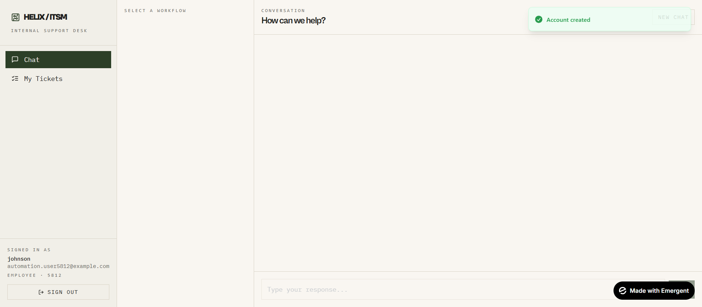
</p>

## Executive Summary

| Quality signal | Latest result |
| --- | --- |
| Total automated tests | 11 |
| Passed | 11 |
| Failed | 0 |
| Success rate | 100% |
| Total duration | 194.44 seconds |
| Execution date | 2026-07-29, 02:14 AM IST |
| Platform | Windows |
| Browser automation | Selenium WebDriver with Chrome |
| Test framework | pytest 9.1.1 |
| Reporting | Allure pytest 2.16.0 |

## Coverage

| Business area | Automated scenarios |
| --- | --- |
| Authentication | Successful login, failed login |
| User registration | Successful signup, failed signup |
| Password management | SAP password reset, Windows password reset |
| Access management | VPN ticket creation |
| Network services | Internet connectivity ticket |
| Communication services | Email and Outlook issue |
| Asset support | Software installation request, hardware request |

## Test Evidence Gallery

Each screenshot below is copied from the latest generated Allure report and stored under `assets/test-evidence/` so recruiters and clients can review visible execution evidence directly from GitHub.

| # | Test case | Category | Duration | Status |
| --- | --- | --- | --- | --- |
| 1 | `test_login_failed` | Authentication | 3.22s | PASSED |
| 2 | `test_sign_up_failed` | Authentication | 4.35s | PASSED |
| 3 | `test_login_success` | Authentication | 5.88s | PASSED |
| 4 | `test_hardware_request_success` | Hardware Management | 14.14s | PASSED |
| 5 | `test_internet_connectivity_success` | Network Services | 16.24s | PASSED |
| 6 | `test_sap_password_ticket_success` | Password Management | 14.94s | PASSED |
| 7 | `test_software_installation_success` | Software Management | 17.06s | PASSED |
| 8 | `test_windows_password_ticket_success` | Password Management | 20.56s | PASSED |
| 9 | `test_email_outlook_success` | Communication Services | 24.20s | PASSED |
| 10 | `test_creation_ticket_success` | VPN Access | 19.26s | PASSED |
| 11 | `test_sign_up_success` | Authentication | 5.26s | PASSED |

<details open>
<summary><strong>1. Failed Login Validation</strong></summary>

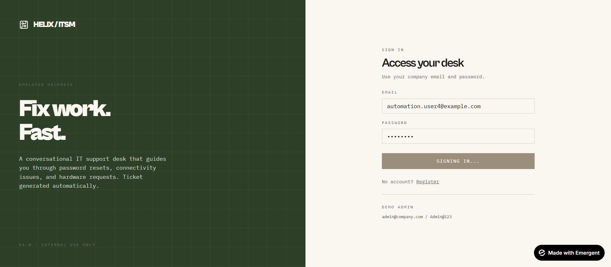
</details>

<details>
<summary><strong>2. Failed Signup Validation</strong></summary>

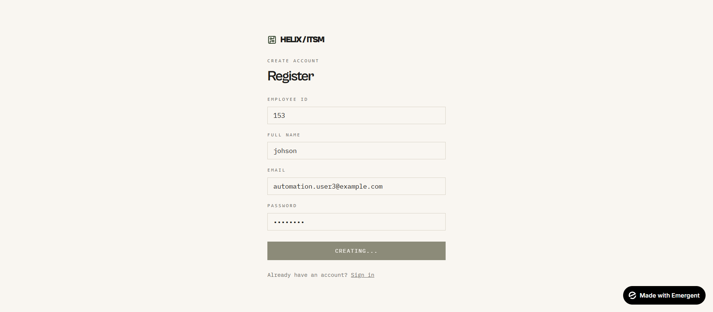
</details>

<details>
<summary><strong>3. Successful Login</strong></summary>

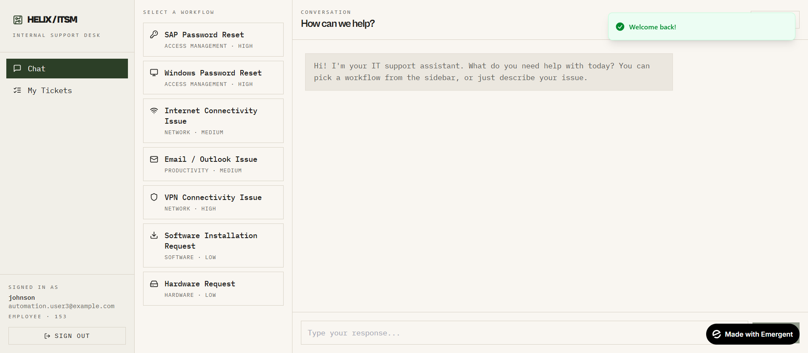
</details>

<details>
<summary><strong>4. Hardware Request Ticket</strong></summary>

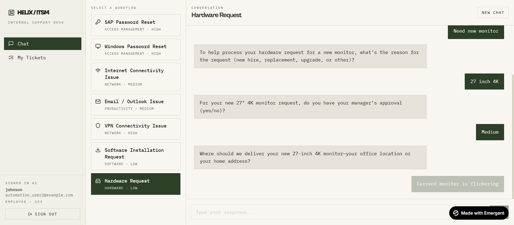
</details>

<details>
<summary><strong>5. Internet Connectivity Ticket</strong></summary>

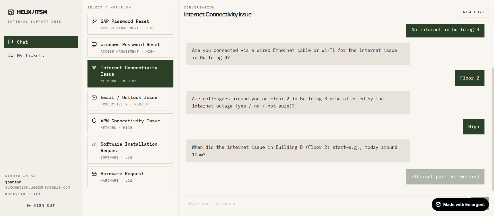
</details>

<details>
<summary><strong>6. SAP Password Reset Ticket</strong></summary>

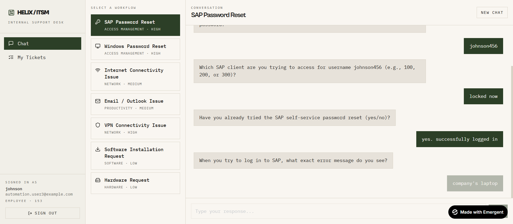
</details>

<details>
<summary><strong>7. Software Installation Ticket</strong></summary>

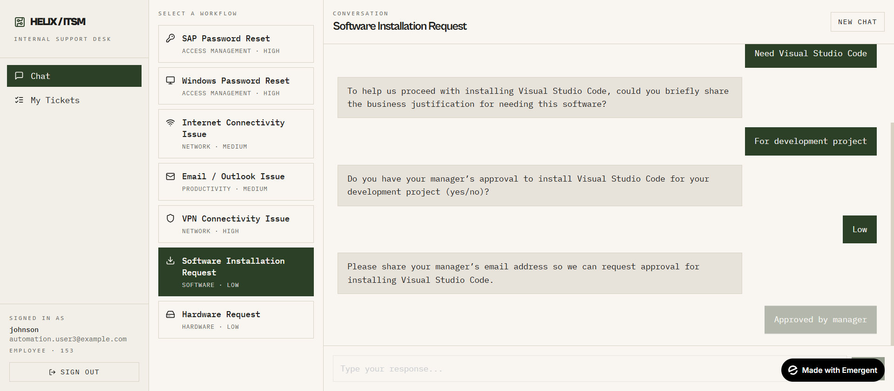
</details>

<details>
<summary><strong>8. Windows Password Reset Ticket</strong></summary>

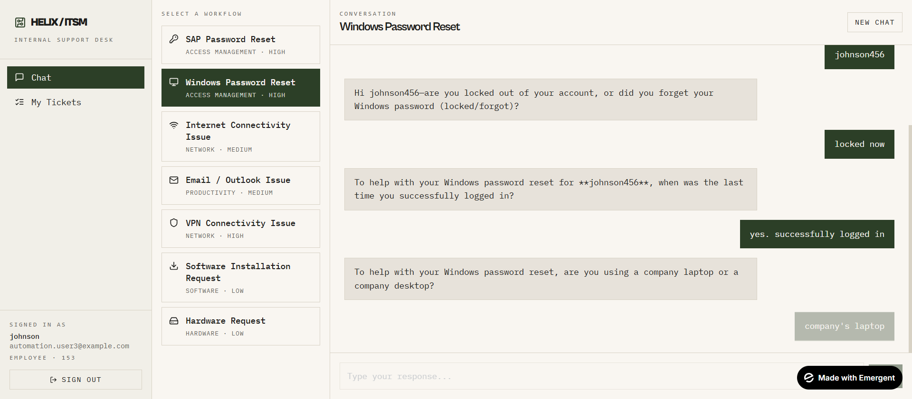
</details>

<details>
<summary><strong>9. Email and Outlook Ticket</strong></summary>

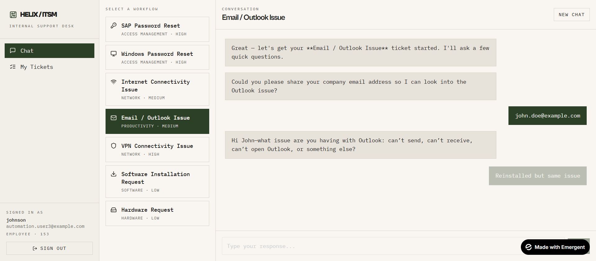
</details>

<details>
<summary><strong>10. VPN Ticket Creation</strong></summary>

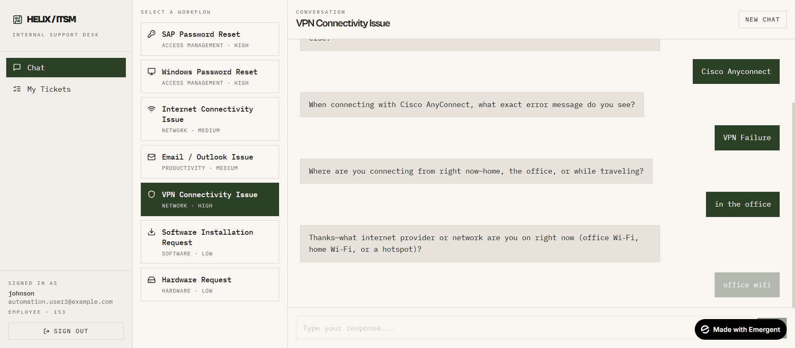
</details>

<details>
<summary><strong>11. Successful Signup</strong></summary>


</details>

## Framework Design

```text
Bot_Automation/
+-- Pages/                  # Page Object Model classes and workflow actions
+-- tests/                  # pytest test cases by business workflow
+-- reports/                # Raw Allure result files generated by pytest
+-- allure-report/          # Generated local Allure HTML report
+-- assets/test-evidence/   # README screenshots copied from Allure attachments
+-- pytest.ini              # pytest configuration with Allure output
+-- run_tests.py            # Test runner and Allure report generator
+-- TEST_RESULTS.json       # Latest summarized execution metrics
`-- requirements.txt        # Python dependencies
```

## Technical Highlights

- Page Object Model structure keeps locators and browser actions reusable.
- `tests/conftest.py` centralizes Chrome WebDriver setup and teardown.
- `pytest_runtest_makereport` captures a screenshot for every executed test case.
- Allure metadata and attachments make execution results easy to audit.
- Positive and negative authentication flows are covered alongside end-to-end helpdesk ticket creation.
- `TEST_RESULTS.json` provides a compact run summary for portfolio and review use.

## Run Locally

```bash
python -m venv .venv
.venv\Scripts\activate
pip install -r requirements.txt
pytest
```

`pytest.ini` writes fresh Allure result files to `reports`.

Generate the interactive Allure HTML report:

```bash
allure generate reports -o allure-report --clean
allure open allure-report
```

Or run the helper script:

```bash
python run_tests.py
```

## Review Notes

The checked-in README evidence uses stable image names under `assets/test-evidence/`. The generated `allure-report/` directory is local execution output and is ignored by `.gitignore`, so the screenshot gallery remains portable while the full interactive Allure report can be regenerated at any time.
